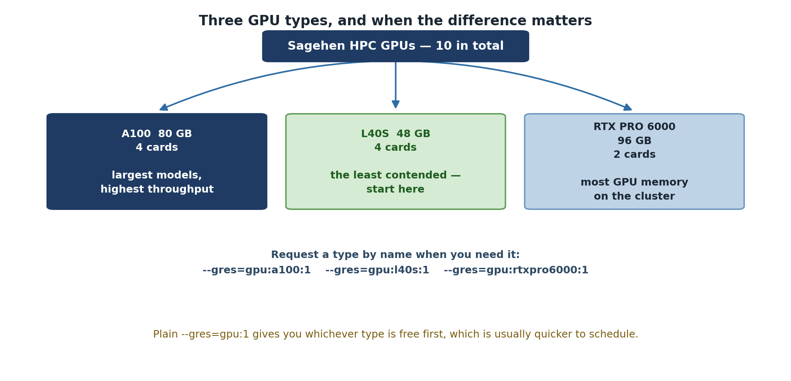

:::::::::::::::::::::::::::::::::::::: questions
- What GPU nodes exist on Sagehen?
- How do you check GPU availability?
- What are GPU memory and compute specifications?
- How do you select specific GPU types?
::::::::::::::::::::::::::::::::::::::::::::::::

::::::::::::::::::::::::::::::::::::: objectives
- Understand Sagehen GPU inventory
- Check available GPU resources
- Select appropriate GPUs for workload
- Understand GPU memory management
::::::::::::::::::::::::::::::::::::::::::::::::

## Sagehen HPC GPU Nodes

Sagehen has **10 GPUs across multiple nodes** (confirmed by Andrew Wilson, May 2026): 4× A100 (80 GB), 4× L40S (48 GB), 2× RTX PRO 6000 (96 GB).

Sagehen has multiple physical GPU nodes (compute nodes that contain GPU cards). The total number of GPU cards across all nodes is 10.

### Available GPU Types

Sagehen provides three tiers of GPU hardware to support a range of research workloads:

- **NVIDIA A100** (80 GB HBM2e, 4 cards): Highest performance, ideal for large models and AI research
- **NVIDIA L40S** (48 GB GDDR6, 4 cards): Excellent balance for most deep learning workflows
- **NVIDIA RTX PRO 6000 Blackwell** (96 GB GDDR7 ECC, 2 cards): Blackwell generation (compute capability 12.0); the largest GPU memory on Sagehen — very large models, memory-heavy simulation, and professional rendering/visualization

Use `sinfo -p gpu --Format=NodeList,Gres,GresUsed` to check current availability.

### GPU Capabilities Summary

| Feature | A100 | L40S | RTX PRO 6000 |
|---------|------|------|--------------|
| Memory | 80 GB HBM2e | 48 GB GDDR6 | 96 GB GDDR7 ECC |
| Architecture | Ampere | Ada Lovelace | Blackwell |
| Compute Capability | 8.0 | 8.9 | 12.0 |
| Best for | Large models, AI research | Deep learning, prototyping, professional | Largest models, memory-heavy work |
| Tensor Cores | Yes (3rd gen) | Yes (4th gen) | Yes (5th gen) |
| Performance Tier | Highest | Very High | Highest |
| Quantity on Sagehen | 4 | 4 | 2 |

For detailed specifications, see NVIDIA's official documentation for each GPU model.
Run `nvidia-smi` on a GPU node to see the exact hardware available to your job.

::::::::::::::::::::::::::::::::::::: callout

{alt='Sagehen HPC has ten GPUs in three types. Four A100 cards with 80 GB, best for the largest models and highest throughput. Four L40S cards with 48 GB, the least contended and the place to start. Two RTX PRO 6000 cards with 96 GB, the most GPU memory on the cluster. A note gives the syntax for requesting a type by name, and observes that a plain --gres=gpu:1 request gives whichever type is free first and is usually quicker to schedule.'}

## GPU Selection Guide

Choose your GPU based on model requirements:
- **Very large models (>80 GB)**: RTX PRO 6000 (96 GB) — the only cards that go beyond 80 GB
- **Large models (48–80 GB)**: A100 (80 GB) or RTX PRO 6000; pick by queue availability
- **Mid-large models (up to 48 GB)**: L40S or A100
- **Standard deep learning**: L40S or A100 for faster training; RTX PRO 6000 if you need ECC memory or huge headroom
- **Prototyping and quick iteration**: L40S — the least contended cards, and 48 GB is ample for small models
- **Memory unsure**: Start with L40S (48 GB middle ground)

Monitor GPU memory during development with `nvidia-smi` to ensure your model fits.

:::::::::::::::::::::::::::::::::::::::::::::::::

## Checking GPU Availability

### Using nvidia-smi

```bash
# Check current GPU status
nvidia-smi

# Output shows available GPUs if on GPU node
```

{alt='Terminal showing an interactive GPU session requested with srun on the gpu partition. The nvidia-smi table reports one NVIDIA A100 80GB PCIe GPU with almost no memory in use and zero percent utilization, driver version 565.57.01 and CUDA version 12.7, and the user then exits back to the login node.'}

### Using SLURM Commands

```bash
# List GPU nodes and availability
sinfo -N -p gpu --Format=NodeList,CPUs,Memory,Features,Available

# Check specific node
scontrol show node <gpu-node>

# Check GPU-specific info
sinfo --Format=NodeList,Gres,GresUsed
```

### In Job Script

```bash
#!/bin/bash
#SBATCH --partition=gpu
#SBATCH --gres=gpu:a100:1

# Inside job, check what was allocated
nvidia-smi
echo "GPUs available: $CUDA_VISIBLE_DEVICES"
```

## Requesting Specific GPUs

### Basic GPU Request

```bash
#SBATCH --gres=gpu:1
```
Requests any available GPU (auto-selected).

### Request Specific Type

```bash
#SBATCH --gres=gpu:a100:1      # Request one A100
#SBATCH --gres=gpu:l40s:2      # Request two L40S
#SBATCH --gres=gpu:rtxpro6000:1  # Request one RTX PRO 6000 (verify the exact GRES name: sinfo -o '%N %G')
```

### Request by Specifications

```bash
#SBATCH --gres=gpu:l40s:1      # Balanced general-purpose GPU
#SBATCH --gres=gpu:a100:1      # Latest high-end GPU
#SBATCH --constraint=GPU_l40s  # Alternative constraint syntax
```

### Multiple GPU Request

```bash
#SBATCH --gres=gpu:4           # Request 4 GPUs (any type)
#SBATCH --gres=gpu:a100:2      # Request 2 A100s specifically
```

**Limits**: Per-account GPU limits apply (contact its-hpc@pomona.edu for current limits).

## GPU Memory Considerations

### Memory Requirements

Choose GPU based on model size:

**Very large models** (48–96 GB): use A100 (80 GB HBM2e) or RTX PRO 6000 (96 GB GDDR7 — the largest single-GPU memory on Sagehen). For models larger than 96 GB, use model parallelism, gradient checkpointing, mixed-precision training, or DeepSpeed/FSDP to fit larger models across multiple GPUs.
- ResNet-3B parameters
- Large language models
- Large transformer models

**Large/medium models** (40–48 GB): L40S or A100 (48 GB+ cards)
- Standard deep learning models
- Fine-tuning mid-sized models
- Computer vision models needing high memory
- Use RTX PRO 6000 if your workflow benefits from ECC memory or needs headroom to grow

**Medium models** (20–40 GB): L40S or A100
- Standard deep learning models
- Fine-tuning large models
- Computer vision models

**Small models** (under 20 GB): L40S — the smallest card on Sagehen is still 48 GB
- Research models
- Small networks
- Training on smaller datasets

### Checking Memory Usage

In running job:

```bash
nvidia-smi --query-gpu=memory.used,memory.total --format=csv
```

In Python:

```python
import torch
print(f"Allocated: {torch.cuda.memory_allocated()} bytes")
print(f"Cached: {torch.cuda.memory_reserved()} bytes")
```

### Memory Management Tips

1. Load model to GPU: `model.cuda()`
2. Load data to GPU: `data = data.cuda()`
3. Check memory: `nvidia-smi`
4. If OOM: Use smaller batch size
5. Clear memory: `del variable; torch.cuda.empty_cache()`

## Cost-Benefit Analysis

### When A100 is Worth It

- Model > 40GB
- Research requiring tensor cores
- Multi-GPU training
- Production deployment

### When L40S is Sufficient

- Standard deep learning (20-48GB models)
- General research
- Training small and medium networks — 48 GB leaves plenty of headroom
- Research prototyping and quick experiments
- Cost-effective for most users, and usually the shortest queue

### When the RTX PRO 6000 is the Right Choice

- Models or datasets needing more than 80 GB of GPU memory (nothing else on Sagehen goes this big)
- 40–80 GB workloads when the A100 queue is long
- Workflows that benefit from ECC memory (numerical stability)
- Professional rendering and scientific visualization
- Cutting-edge Blackwell features (compute capability 12.0, 5th-gen Tensor Cores)

## Node Selection Strategy

```bash
# For cost-effective general work
#SBATCH --gres=gpu:l40s:1

# For memory-heavy models (48–80 GB)
#SBATCH --gres=gpu:a100:1

# For the very largest models (up to 96 GB)
#SBATCH --gres=gpu:rtxpro6000:1  # verify exact GRES name: sinfo -o '%N %G'

# For quick testing
#SBATCH --gres=gpu:l40s:1

# For production multi-GPU training
#SBATCH --gres=gpu:a100:2
```

::::::::::::::::::::::::::::::::::::: challenge

## Challenge: Choose Your GPU

For each research scenario below, recommend the best Sagehen GPU
(A100 80 GB, L40S 48 GB, or RTX PRO 6000 96 GB) and explain your reasoning.

**Scenario A:** A student is fine-tuning a large language model that requires 60 GB
of GPU memory during training.

**Scenario B:** A researcher is prototyping a small image classifier with a dataset
of 1,000 images. They expect the model to use about 4 GB of GPU memory and want
results quickly for iteration.

**Scenario C:** A lab group is training a computer vision model (ResNet-50) that
uses about 25 GB of GPU memory and will run for several days.

**Scenario D:** A computational chemist needs to run a numerical simulation that
fits in roughly 40 GB of GPU memory and is sensitive to bit-flip errors. The A100
queue is currently several days deep.

::::::::::::::::::::::::::::::::::::: solution

## Solution

**Scenario A: A100 (80 GB) or RTX PRO 6000 (96 GB)**
The model requires 60 GB of GPU memory, which exceeds the L40S's 48 GB. Both the
A100 (80 GB HBM2e) and the RTX PRO 6000 (96 GB GDDR7) fit the workload — pick
whichever queue is shorter. The A100's HBM bandwidth favours
training throughput; the RTX PRO 6000 leaves more memory headroom.

**Scenario B: L40S (48 GB)**
The model only needs about 4 GB, so it fits trivially on an L40S. The L40S cards
are also the least contended on Sagehen, so queue waits are typically shortest —
exactly what you want when iterating quickly. Tying up an A100 or RTX PRO 6000 for
a 4 GB job would waste the cards that large models depend on.

**Scenario C: L40S (48 GB)**
The 25 GB memory requirement fits comfortably on the L40S (48 GB), with excellent
compute throughput for a multi-day training run. This leaves the A100s and
RTX PRO 6000s free for jobs that genuinely need more than 48 GB.

**Scenario D: RTX PRO 6000 (96 GB)**
The 40 GB workload fits easily, and the RTX PRO 6000's ECC GDDR7 protects against
bit-flip-induced numerical errors during a long simulation — exactly what these
cards' ECC is for. The A100 also offers ECC but has the deep queue; the RTX PRO
6000 delivers the ECC protection with plenty of headroom.

::::::::::::::::::::::::::::::::::::::::::::::::

::::::::::::::::::::::::::::::::::::::::::::::::

::::::::::::::::::::::::::::::::::::: keypoints
- Sagehen has 10 GPUs across three types: A100, L40S, and RTX PRO 6000
- RTX PRO 6000: Largest memory on Sagehen (96 GB GDDR7 ECC, Blackwell)
- A100: 80 GB HBM2e, best training throughput for large models
- L40S: Best value for most deep learning at 48 GB
- Use --gres=gpu:type:count to request specific GPUs
- Monitor memory usage; request right-sized GPU
- Consider cost-benefit and queue depth when choosing GPU type
::::::::::::::::::::::::::::::::::::::::::::::::
